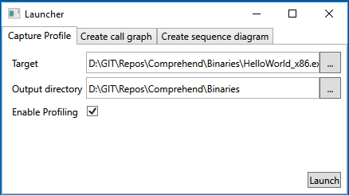
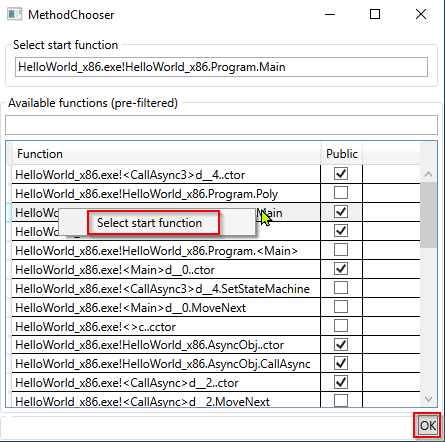

# Comprehend

Proof of concept: Generating sequence diagrams from profiler traces.

## Prerequisites
This tool uses the 3rd party component Plantuml to generate sequence diagrams.
Download plantuml.jar from https://plantuml.com/de/download and copy it to Binaries\Dependencies

## Description

This application consists of two parts:
1. A minimum profiler to trace method calls in .NET applications. The profiler writes all called methods to a file.
2. A sample application that allows starting a .NET application with the profiler. This application also can load the profile and generate a sequence diagram via Plantuml.

## Usage

### 1. Collect traces

Start launcher.exe and run the application to be profiled.

Be aware that a large amount of profiling information is written to the hard disk. Starting a larger application can soon result in 5+ GB. Therefore you can decide when to start collecting data with the "Enable Profiling" checkbox. You can only defer profiling to a later time but you cannot disable it after that. And you cannot attach to a running application.

### 2. Create a sequence diagram

Go to the tab "Create sequence diagram" and select the profile you collected.

"Edit Pre-Filter" opens a text file that filters a lot of the default .NET namespaces you don't want to see in a sequence diagram. You can add further elements here.

Clicking on "Generate" opens a dialog that lets you define your diagram. You have to select the entry function for the sequence diagram and all method calls you want to include. Note that you can refine your diagram again and again by adding or removing functions. Use the context menu to select the entry function.

## Notes and limitations

The result is shown in an svg viewer. The input plantuml file is written to the output directory.

You can hide method calls in the Method Chooser window. If you hide a call that results in a call you want to see the arrow is drawn in blue color. Meaning the method CycleA calls CycleA indirectly and hiding calls in between.

